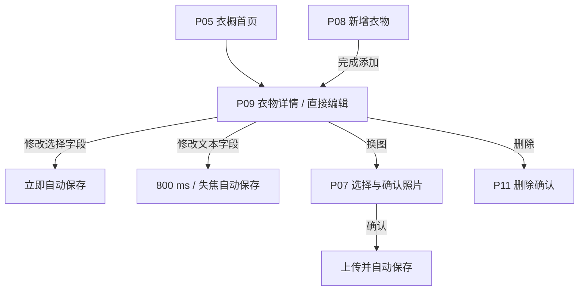

# 衣序 YISU 衣物详情直接编辑与自动保存实施计划

> **For agentic workers:** REQUIRED SUB-SKILL: Use superpowers:subagent-driven-development (recommended) or superpowers:executing-plans to implement this plan task-by-task. Steps use checkbox (`- [ ]`) syntax for tracking.

**Goal:** 将 P09 改为可直接编辑并字段级自动保存的衣物详情页，保留 P08“完成添加”，统一 P08/P09 换图入口，归档 P10 独立编辑流程，并同步需求、Figma、状态台账和项目交付管理包。

**Architecture:** 先更新 PRD 与 AI 原型需求作为唯一上游基线，再修改 Figma `04 Wireframes` 和 `05 Prototype`，随后重制 Gate B1 的 P09 高保真候选稿。P09 使用本地优先的字段级更新语义和页面级保存状态汇总；P08 仍采用一次性创建。所有旧 P10 画面保留为历史归档，但从正式页面清单、热点与开发交付中移除。

**Tech Stack:** Markdown、Figma Design/MCP、iOS NavigationStack/PhotosPicker 交互规范、SwiftUI 可实现性约束、JSON 状态台账、`@oai/artifact-tool`、Excel `.xlsx`

## Global Constraints

- Figma 文件固定为 `UMn1NvC2IUOA4xlXpLETRL`，不得新建替代文件。
- P01 登录和 P05 首页视觉不重做；P05 只调整进入 P09 后的数据同步语义。
- P09 没有“编辑”和“保存”按钮；P10 不再是正式页面。
- P08 不采用字段自动保存，主按钮文案为“完成添加”。
- 文本输入停止约 800 ms、失焦或键盘收起时提交；选择型字段完成选择后立即提交。
- P08/P09 顶部大图右下角使用统一“换图”图标按钮，最小触控区域 `44×44 pt`。
- P09 换图失败时继续显示原照片；P08 换图取消时保留当前表单与照片。
- P09 保留两张暖白信息卡，不显示“重要信息”“其他信息”标题和二级标题。
- 历史画面不得删除；统一增加 `ARCHIVED / 已合并至 P09` 标识并从交付主流程排除。
- 项目周期及状态调整必须更新 `outputs/project-delivery-management/衣序YISU-项目交付管理包-iOS原生基线-20260722.xlsx`，不得另建管理基线文件。
- 不实现批量编辑、版本历史、撤销修改、AI 识别、搭配或多角色能力。

---

## File and Artifact Map

| 责任 | 文件或 Figma 页面 | 修改原则 |
|---|---|---|
| 产品基线 | `AI数字衣橱-PRD-20260717.md` | 增量融合，增加版本记录，不重写无关章节 |
| AI 原型输入 | `衣序YISU-GateA-AI原型设计需求-20260810.md` | 更新流程、页面表、P08–P10、状态与验收 |
| 需求追踪 | `AI数字衣橱-需求清单-20260717.md` | 删除独立 P10 交付口径，补充自动保存和换图验收 |
| 低保真 | Figma `04 Wireframes`，页面 `14:5` | 在历史稿旁建立本次修订区；原画面保留归档 |
| 可点击原型 | Figma `05 Prototype`，页面 `115:126` | 重接 P05/P08/P09/P11，移除正式 P10 热点 |
| 高保真 | Figma `06 Hi-Fi Exploration`，页面 `168:2` | 更新 P09 `220:2` 与完整视图 `232:2` 的修订副本 |
| Phase 1 台账 | `.codex-tmp/yisu-figma-phase1-state.json` | 记录新节点、归档节点、边数和死链审计 |
| Phase 2 台账 | `.codex-tmp/yisu-figma-phase2-state.json` | 将 P09 状态改为重新评审，记录自动保存和换图审计 |
| 设计基线 | `docs/superpowers/specs/2026-08-13-yisu-gate-a-high-fidelity-ui-design.md` | 合并新的 P09/P10 页面规则 |
| 高保真计划 | `docs/superpowers/plans/2026-08-13-yisu-gate-a-high-fidelity-ui.md` | 重写 B1 P09 与 B5 衣物管理任务 |
| 交付说明 | `figma-deliverables/衣序YISU-GateA原型与UI设计/README.md` | 记录变更原因、节点、验收证据和历史稿状态 |
| 管理基线 | `outputs/project-delivery-management/衣序YISU-项目交付管理包-iOS原生基线-20260722.xlsx` | 更新 WBS、Backlog、决策日志、RAID 和里程碑说明 |

---

### Task 1: 更新产品需求基线

**Files:**
- Modify: `AI数字衣橱-PRD-20260717.md`
- Modify: `衣序YISU-GateA-AI原型设计需求-20260810.md`
- Modify: `AI数字衣橱-需求清单-20260717.md`
- Reference: `docs/superpowers/specs/2026-08-14-yisu-inline-detail-autosave-design.md`

**Interfaces:**
- Consumes: 已确认的页面职责、自动保存触发、换图和异常规则。
- Produces: P05/P08/P09/P10/P11 的唯一文字基线，供 Figma 与管理包引用。

- [ ] **Step 1: 在 PRD 增加版本记录**

在版本表新增一行，内容固定为：

```markdown
| v1.8 | 2026-08-14 | 详情即编辑与字段级自动保存 | P09 直接编辑并自动保存；P08 保留“完成添加”；P08/P09 增加换图；P10 合并归档 | Codex / 用户确认 |
```

- [ ] **Step 2: 更新 PRD 页面与照片规则**

将 Gate A 页面范围中的“编辑”改为“详情直接编辑”，并将照片规则改为：P08 确认照片后只更新新增表单；P09 确认新照片后自动上传和保存；换图失败保留原照片。删除“只有点击编辑页保存后才正式替换原照片”的旧规则。

- [ ] **Step 3: 在 PRD 写入自动保存状态和数据语义**

明确六态：空闲、待提交、保存中、已保存、保存失败、待同步；写入 800 ms 防抖、选择后立即保存、最新输入优先、请求幂等、本地待同步和账号隔离规则。

- [ ] **Step 4: 更新 AI 原型需求的用户流程与页面表**

将主流程改为：



页面表中保留 P10 编号，但状态写为“已合并至 P09 / 不开发 / 历史归档”，避免编号重排造成既有引用失效。

- [ ] **Step 5: 重写 P08–P10 页面定义**

P08 写明“完成添加”、必填校验、创建中和创建失败；P09 写明可编辑控件、自动保存六态、更多菜单删除与换图；P10 只保留一段归档说明，不再定义保存、取消或放弃更改状态。

同时在账户退出规则中写明：存在待同步修改时，退出登录前提示“仍有衣物修改尚未同步”，提供“继续同步”和“放弃并退出”；不得将当前账号的待同步队列带入另一个账号。

- [ ] **Step 6: 更新验收用例和需求清单**

加入 `AC-EDIT-01` 至 `AC-EDIT-08`、`AC-ADD-01` 至 `AC-ADD-03`、`AC-FLOW-01`；需求清单将“进入 P10 编辑并保存”替换为“在 P09 修改并自动保存”。

- [ ] **Step 7: 扫描旧口径**

Run:

```bash
rg -n '编辑 → P10|进入编辑页|编辑取消|放弃未保存|点击.*保存后|P10.*保存中|P10.*保存失败' AI数字衣橱-PRD-20260717.md 衣序YISU-GateA-AI原型设计需求-20260810.md AI数字衣橱-需求清单-20260717.md
```

Expected: 仅命中版本历史或明确标注“旧流程已废弃”的说明；不得存在有效需求口径冲突。

- [ ] **Step 8: 检查文档格式并提交**

Run:

```bash
git diff --check -- AI数字衣橱-PRD-20260717.md 衣序YISU-GateA-AI原型设计需求-20260810.md AI数字衣橱-需求清单-20260717.md
```

Expected: 无输出。

Commit:

```bash
git add -- AI数字衣橱-PRD-20260717.md 衣序YISU-GateA-AI原型设计需求-20260810.md AI数字衣橱-需求清单-20260717.md
git commit -m "docs: merge garment editing into detail flow"
```

---

### Task 2: 修改 Figma 04 Wireframes

**Files:**
- Modify: Figma file `UMn1NvC2IUOA4xlXpLETRL`, page `04 Wireframes` (`14:5`)
- Modify: `.codex-tmp/yisu-figma-phase1-state.json`
- Modify: `figma-deliverables/衣序YISU-GateA原型与UI设计/README.md`

**Interfaces:**
- Consumes: Task 1 的 P08/P09/P10 页面定义和字段顺序。
- Produces: 可供 05 Prototype 直接连线的 P08/P09 状态画面和历史 P10 归档区。

- [ ] **Step 1: 加载 Figma 写入规范并审计当前节点**

执行前完整读取 `figma:figma-use`、`figma:figma-generate-design` 和 `figma:figma-swiftui`。读取并核对现有节点：P08 状态组 `88:124`、P09 状态组 `93:124`、P10 状态组 `97:124`。

- [ ] **Step 2: 保护历史基线**

复制 P08/P09 状态组到同页新的“2026-08-14 详情即编辑修订”区域。原 P10 状态组增加 `ARCHIVED / 功能已合并至 P09 / 2026-08-14` 标识，不删除任何原节点。

- [ ] **Step 3: 重制 P09 正常状态**

删除右上角“编辑”，替换为“更多”；名称、品牌、价格、备注展示输入意图；选择字段增加右侧进入符号；大图右下角增加 `44×44 pt` 换图按钮；两张卡片不显示分组标题。

- [ ] **Step 4: 增加 P09 自动保存状态**

在修订区建立以下独立评审画面：

```text
P09 / 直接编辑 / 空闲
P09 / 文本输入中 / 待提交
P09 / 保存中
P09 / 已保存
P09 / 保存失败
P09 / 待同步后返回
P09 / 换图上传失败
P09 / 加载失败
```

保存反馈位于名称/标签与第一张信息卡之间，不遮挡字段，不改变大图第一视觉层级。

- [ ] **Step 5: 更新 P08 状态**

将“保存”文案统一为“完成添加”；在默认、校验失败、创建中和创建失败画面的大图右下角加入换图按钮；确保按钮禁用规则仍由图片、名称、分类、季节共同决定。

- [ ] **Step 6: 增加待同步退出提示状态**

在 P05“我的基础页”或 P12 全局反馈修订区增加“仍有衣物修改尚未同步”的退出确认状态，操作为“继续同步”和“放弃并退出”。该状态仅在用户主动退出账号且存在待同步修改时出现，普通页面返回不出现。

- [ ] **Step 7: 执行线框审计**

使用 Figma 脚本统计并验证：

```js
const requiredP09 = ["空闲", "待提交", "保存中", "已保存", "保存失败", "待同步后返回", "换图上传失败", "加载失败"];
const prohibitedCopy = ["编辑", "保存", "放弃未保存的更改"];
```

Expected: 八个 P09 状态齐全；正式 P09 不含禁用文案；P08 主操作均为“完成添加”；P08/P09 换图触控区均不小于 `44×44 pt`；非滚动横向文字溢出为 0。

- [ ] **Step 8: 更新 Phase 1 状态和交付说明**

在 `.codex-tmp/yisu-figma-phase1-state.json` 记录修订区节点、P08/P09 新节点、P10 归档节点和审计结果；README 记录“历史基线保留、开发基线切换至修订区”。

- [ ] **Step 9: 校验 JSON 并提交本地台账**

Run:

```bash
python -m json.tool .codex-tmp/yisu-figma-phase1-state.json >/dev/null
git diff --check -- .codex-tmp/yisu-figma-phase1-state.json figma-deliverables/衣序YISU-GateA原型与UI设计/README.md
```

Expected: JSON 合法，格式检查无输出。

Commit:

```bash
git add -- .codex-tmp/yisu-figma-phase1-state.json figma-deliverables/衣序YISU-GateA原型与UI设计/README.md
git commit -m "design: revise garment management wireframes"
```

**Checkpoint:** 向用户提交 P08 默认、P09 空闲、P09 保存失败、待同步退出提示和 P10 归档五张截图；获得确认后再修改 05 Prototype。

---

### Task 3: 重接 Figma 05 Prototype

**Files:**
- Modify: Figma file `UMn1NvC2IUOA4xlXpLETRL`, page `05 Prototype` (`115:126`)
- Modify: `.codex-tmp/yisu-figma-phase1-state.json`
- Modify: `figma-deliverables/衣序YISU-GateA原型与UI设计/README.md`

**Interfaces:**
- Consumes: Task 2 已确认的 P08/P09 修订画面。
- Produces: 没有 P10 正式入口的可点击衣物管理主流程，以及可审计的来源感知换图流程。

- [ ] **Step 1: 复制现有原型画面建立修订区**

保留原 39 个顶层画面作为已验收历史基线，在同页建立“2026-08-14 详情即编辑 Prototype Revision”。只从复制画面开始修改，避免破坏历史证据。

- [ ] **Step 2: 重接 P05 → P09**

衣物卡片进入 P09 空闲状态；P09 返回进入原 P05，并保留首页筛选条件和滚动位置。删除 P09“编辑”热点以及所有进入 P10 的正式边。

- [ ] **Step 3: 连接字段编辑与自动保存**

选择字段按以下状态链连接：

```text
P09 空闲 → 字段选择面板 → 完成 → P09 保存中 → P09 已保存 → P09 空闲
P09 空闲 → 字段选择面板 → 取消 → P09 空闲
P09 保存中 → 请求失败 → P09 保存失败 → 点击重试 → P09 保存中
```

文本字段使用“输入中/待提交 → 保存中 → 已保存”的演示链路，并设置失败分支。

- [ ] **Step 4: 连接 P08 换图流程**

`P08 → 选择照片 → 确认照片 → P08`；任意取消回到原 P08 状态并保留表单。点击“完成添加”进入创建中，成功进入 P09，失败回到 P08 创建失败。

- [ ] **Step 5: 连接 P09 换图流程**

`P09 → 重新选择照片 → 确认照片 → 上传保存 → P09`；取消始终返回原 P09；上传失败进入“换图上传失败”，原照片保持可见，重试返回上传保存。

- [ ] **Step 6: 保留删除流程**

P09 更多菜单进入 P11；删除取消返回同一 P09，删除成功返回 P05，删除失败返回 P09 并保留当前衣物。

- [ ] **Step 7: 连接待同步退出流程**

在“我的基础页”点击退出时，如果存在待同步修改，进入退出确认；“继续同步”关闭提示并保留当前账号，“放弃并退出”清理该账号的待同步队列后退出。无待同步修改时沿用正常退出流程。

- [ ] **Step 8: 执行原型图审计**

统计顶层修订画面、全部导航边和目标节点，验证：

```text
正式 P10 入边 = 0
正式 P10 出边 = 0
失效目标 = 0
P08 换图取消目标 = P08
P09 换图取消目标 = P09
P09 返回目标 = P05
待同步退出“继续同步”目标 = 我的基础页
待同步退出“放弃并退出”目标 = 登录页
```

逐条演示 AC-EDIT-01、02、03、04、06、07、08、AC-ADD-01、02、03 和 AC-FLOW-01；另验证待同步修改不会跨账号提交。

- [ ] **Step 9: 更新台账并提交**

Run:

```bash
python -m json.tool .codex-tmp/yisu-figma-phase1-state.json >/dev/null
git diff --check -- .codex-tmp/yisu-figma-phase1-state.json figma-deliverables/衣序YISU-GateA原型与UI设计/README.md
```

Expected: JSON 合法，格式检查无输出，README 记录新的边数和失效目标 0。

Commit:

```bash
git add -- .codex-tmp/yisu-figma-phase1-state.json figma-deliverables/衣序YISU-GateA原型与UI设计/README.md
git commit -m "design: reconnect inline editing prototype"
```

**Checkpoint:** 向用户演示“首页进入详情直接修改”“自动保存失败重试”“P08 换图取消”“P09 换图取消/失败”“删除取消”和“待同步退出”六条路径；确认后进入高保真修改。

---

### Task 4: 更新 Gate B1 P09 高保真方向稿

**Files:**
- Modify: Figma file `UMn1NvC2IUOA4xlXpLETRL`, page `06 Hi-Fi Exploration` (`168:2`)
- Modify: `.codex-tmp/yisu-figma-phase2-state.json`
- Modify: `docs/superpowers/specs/2026-08-13-yisu-gate-a-high-fidelity-ui-design.md`
- Modify: `docs/superpowers/plans/2026-08-13-yisu-gate-a-high-fidelity-ui.md`
- Modify: `figma-deliverables/衣序YISU-GateA原型与UI设计/README.md`

**Interfaces:**
- Consumes: Task 2/3 已确认结构和交互；P05 V3B `187:10`、P01 `209:2` 的视觉语言。
- Produces: 可供 Gate B1 重新确认的 P09 可滚动稿、完整内容开发视图和关键状态样稿。

- [ ] **Step 1: 保留 P09 v2 历史候选稿**

将 `220:2` 和 `232:2` 标记为 `ARCHIVED / Before inline editing / 2026-08-14`，复制为新的 P09 v3 工作稿。不得覆盖或删除 v2。

- [ ] **Step 2: 重制 P09 v3 空闲状态**

删除“编辑”按钮；右上角使用更多图标；大图右下角增加换图图标；字段行增加可编辑意图；名称保持第一信息层级；两张暖白卡片保持 24 pt 间距且不显示分组标题。

- [ ] **Step 3: 制作保存状态样稿**

至少建立：`保存中`、`已保存`、`保存失败` 三张同结构状态。状态提示使用 V3B 的薰衣草、鼠尾草和错误语义色，不能改变页面布局或造成内容跳动。

- [ ] **Step 4: 更新完整内容开发视图**

完整视图必须展示 P09 全部字段、换图入口、字段编辑提示和保存反馈位置；其用途只作为开发说明，不代表设备固定高度。

- [ ] **Step 5: 执行高保真十项审计**

验证：8 pt 栅格、顶部/底部安全区、触控区域、文本层级、自动保存状态、统一图标、真实衣物图片、V3B 一致性、交互意图和开发证据。额外验证：

```text
滚动稿与完整视图字段文本条目一致
“编辑”按钮数量 = 0
统一“保存”按钮数量 = 0
换图触控区 >= 44×44 pt
非滚动横向文字溢出 = 0
占位内容 = 0
```

- [ ] **Step 6: 更新 Phase 2 台账与 B1 状态**

将原 `p09V3BCandidate` 标记为 superseded；记录 v3 节点、完整视图节点、三张保存状态节点和审计结果。B1 继续 `in_progress`，P01/P05 保持已确认，P09 改为 `awaiting_user_review`。

- [ ] **Step 7: 同步高保真规格和执行计划**

将原 B1/B5 中“详情 + 编辑页 + 保存”的描述改为“P09 详情即编辑 + 自动保存；P10 归档；P08 完成添加”。不得提前将未制作的 P08 高保真标记为完成。

- [ ] **Step 8: 验证并提交本地文件**

Run:

```bash
python -m json.tool .codex-tmp/yisu-figma-phase2-state.json >/dev/null
rg -n 'P10.*保存|编辑取消|放弃未保存|进入编辑页' docs/superpowers/specs/2026-08-13-yisu-gate-a-high-fidelity-ui-design.md docs/superpowers/plans/2026-08-13-yisu-gate-a-high-fidelity-ui.md figma-deliverables/衣序YISU-GateA原型与UI设计/README.md
git diff --check -- .codex-tmp/yisu-figma-phase2-state.json docs/superpowers/specs/2026-08-13-yisu-gate-a-high-fidelity-ui-design.md docs/superpowers/plans/2026-08-13-yisu-gate-a-high-fidelity-ui.md figma-deliverables/衣序YISU-GateA原型与UI设计/README.md
```

Expected: 第一条只命中历史说明，格式检查无输出。

Commit:

```bash
git add -- .codex-tmp/yisu-figma-phase2-state.json docs/superpowers/specs/2026-08-13-yisu-gate-a-high-fidelity-ui-design.md docs/superpowers/plans/2026-08-13-yisu-gate-a-high-fidelity-ui.md figma-deliverables/衣序YISU-GateA原型与UI设计/README.md
git commit -m "design: revise P09 for inline autosave"
```

**Checkpoint:** 提交 P09 v3 空闲、保存失败、可滚动稿和完整开发视图供用户确认；确认后再制作 P01/P05/P09 三页一致性说明并完成 Gate B1。

---

### Task 5: 更新项目交付管理包

**Files:**
- Modify: `outputs/project-delivery-management/衣序YISU-项目交付管理包-iOS原生基线-20260722.xlsx`
- Create or Modify: `.codex-tmp/artifact-work/update-inline-editing-workbook.mjs`

**Interfaces:**
- Consumes: Task 1–4 的最终页面范围、审计状态、工作量和风险。
- Produces: 保持原格式和公式的唯一项目周期管理基线。

- [ ] **Step 1: 加载工作区依赖和必读表格规范**

调用 `codex_app__load_workspace_dependencies`，完整读取 loader 返回的 `style_guidelines.md` 和 `artifact_tool_docs/API_QUICK_START.md`。使用 loader 提供的 Node 和 `@oai/artifact-tool`，不得使用 `openpyxl` 或其他替代写库。

- [ ] **Step 2: 标记一次编辑操作并导入工作簿**

在首次写入前运行：

```bash
node container_tools/mark_artifact_operation_started.mjs --operation-kind edit --expected-output-count 1 --output-format xlsx
```

在 `.codex-tmp/artifact-work` 中复用或建立 loader 指定的 `node_modules` 链接，导入原管理包并先读取关键范围和公式。

- [ ] **Step 3: 更新 WBS 与 Sprint Backlog**

将 B1/P09 的工作说明改为“详情即编辑、自动保存状态、换图和重新确认”；将 B5 改为“照片、完成添加、详情直接编辑、自动保存、删除”，不再列独立编辑页。若范围导致工时变化，只更新受影响任务，不移动已完成任务的实际日期。

- [ ] **Step 4: 新增决策日志**

新增 `DEC-014`：

```text
主题：衣物详情与编辑合并，采用字段级自动保存
决定：P09 直接编辑；文本 800 ms/失焦保存；选择完成即保存；P08 保留完成添加；P10 合并归档；P08/P09 增加换图
影响：PRD、AI 原型需求、04 Wireframes、05 Prototype、P09 高保真、Sprint Backlog、验收用例
状态：已决定
```

- [ ] **Step 5: 更新 RAID 与里程碑说明**

增加或更新风险：自动保存请求乱序、弱网待同步、照片替换失败和旧 P10 口径误用。缓解措施分别写入版本/序号保护、本地幂等队列、原图保留与重试、全链路旧口径扫描。Gate B1 保持进行中，直到 P09 v3 和三页一致性说明获确认。

- [ ] **Step 6: 检查公式和关键范围**

使用 `workbook.inspect` 检查：`02 WBS`、`04 RAID`、`05 里程碑`、`07 Sprint Backlog`、`08 决策日志` 的受影响区域及公式。运行全工作簿错误扫描：

```js
const errors = await workbook.inspect({
  kind: "match",
  searchTerm: "#REF!|#DIV/0!|#VALUE!|#NAME\\?|#N/A",
  options: { useRegex: true, maxResults: 300 },
  summary: "inline editing workbook formula error scan",
});
```

Expected: 不新增公式错误；日期、工时、完成度仍为类型化数值或日期，不写成展示字符串。

- [ ] **Step 7: 渲染并检查全部工作表**

至少渲染 `00 使用说明` 至 `08 决策日志` 的使用区域，逐页确认表头、关键文字、日期、工时、状态和长文案无裁切。只做受影响单元格的局部宽度或行高修复，不进行全表重排。

- [ ] **Step 8: 覆盖唯一管理基线并验证导出**

导出回原路径：

```text
outputs/project-delivery-management/衣序YISU-项目交付管理包-iOS原生基线-20260722.xlsx
```

重新导入最终文件，复查关键范围、`DEC-014`、B1/B5 文案和错误扫描。

- [ ] **Step 9: 提交工作簿**

```bash
git add -- outputs/project-delivery-management/衣序YISU-项目交付管理包-iOS原生基线-20260722.xlsx
git commit -m "docs: sync inline editing delivery plan"
```

---

### Task 6: 跨交付物一致性审计与阶段交付

**Files:**
- Verify: `AI数字衣橱-PRD-20260717.md`
- Verify: `衣序YISU-GateA-AI原型设计需求-20260810.md`
- Verify: `AI数字衣橱-需求清单-20260717.md`
- Verify: `.codex-tmp/yisu-figma-phase1-state.json`
- Verify: `.codex-tmp/yisu-figma-phase2-state.json`
- Verify: `docs/superpowers/specs/2026-08-13-yisu-gate-a-high-fidelity-ui-design.md`
- Verify: `docs/superpowers/plans/2026-08-13-yisu-gate-a-high-fidelity-ui.md`
- Verify: `figma-deliverables/衣序YISU-GateA原型与UI设计/README.md`
- Verify: `outputs/project-delivery-management/衣序YISU-项目交付管理包-iOS原生基线-20260722.xlsx`
- Verify: Figma pages `04 Wireframes`, `05 Prototype`, `06 Hi-Fi Exploration`

**Interfaces:**
- Consumes: Task 1–5 的全部产物。
- Produces: 可供用户确认和后续 SwiftUI 开发引用的统一设计基线。

- [ ] **Step 1: 运行文字口径审计**

Run:

```bash
rg -n '编辑 → P10|P09.*编辑入口|编辑取消返回|放弃未保存|只有点击.*保存|P10.*保存中|P10.*保存失败' AI数字衣橱-PRD-20260717.md 衣序YISU-GateA-AI原型设计需求-20260810.md AI数字衣橱-需求清单-20260717.md docs/superpowers/specs/2026-08-13-yisu-gate-a-high-fidelity-ui-design.md docs/superpowers/plans/2026-08-13-yisu-gate-a-high-fidelity-ui.md figma-deliverables/衣序YISU-GateA原型与UI设计/README.md
```

Expected: 仅命中历史归档或废弃说明。

- [ ] **Step 2: 运行必需口径审计**

Run:

```bash
rg -n '详情即编辑|自动保存|800|完成添加|换图|已合并至 P09|待同步' AI数字衣橱-PRD-20260717.md 衣序YISU-GateA-AI原型设计需求-20260810.md AI数字衣橱-需求清单-20260717.md docs/superpowers/specs/2026-08-13-yisu-gate-a-high-fidelity-ui-design.md docs/superpowers/plans/2026-08-13-yisu-gate-a-high-fidelity-ui.md figma-deliverables/衣序YISU-GateA原型与UI设计/README.md
```

Expected: 每个正式基线文件均覆盖其职责相关的新口径。

- [ ] **Step 3: 运行 JSON、Markdown 和 Git 检查**

Run:

```bash
python -m json.tool .codex-tmp/yisu-figma-phase1-state.json >/dev/null
python -m json.tool .codex-tmp/yisu-figma-phase2-state.json >/dev/null
git diff --check
git status --short
```

Expected: 两个 JSON 合法；无本轮新增格式错误；状态输出中的其他既有改动必须明确区分，不得误提交。

- [ ] **Step 4: 运行 Figma 结构与热点审计**

检查三个页面并生成审计摘要：修订节点齐全、P10 正式入边/出边均为 0、失效目标 0、P08/P09 换图返回正确、P09 滚动稿与完整视图字段一致、P09 不含编辑/保存按钮。

- [ ] **Step 5: 逐项执行验收用例**

执行规格中的 `AC-EDIT-01` 至 `AC-EDIT-08`、`AC-ADD-01` 至 `AC-ADD-03`、`AC-FLOW-01`。每项在 README 或状态台账记录通过/失败、证据节点和修复结果。

- [ ] **Step 6: 提交用户阶段验收**

交付以下证据：

```text
1. PRD 与 AI 原型需求变更摘要
2. 04 Wireframes 四张关键状态截图
3. 05 Prototype 五条关键路径
4. P09 v3 空闲、保存失败、滚动稿、完整开发视图
5. 项目交付管理包更新摘要
6. 跨交付物口径与死链审计结果
```

用户确认后，完成 Gate B1 三页一致性说明；Gate B1 通过后再按既定 B2–B6 顺序推进，P08 高保真仍在 Gate B5 制作，不提前打乱分批验收节奏。

---

## Execution Checkpoints

1. Task 1 完成：文字基线内部审计，不单独暂停。
2. Task 2 完成：用户确认 04 Wireframes 修订。
3. Task 3 完成：用户确认 05 Prototype 关键路径。
4. Task 4 完成：用户确认 P09 v3 高保真。
5. Task 5–6 完成：提交完整阶段验收与管理包。

## Completion Definition

- P09 在需求、线框、原型和高保真中均为直接编辑页面。
- P10 只作为历史归档存在，正式热点和开发页面清单不再引用。
- P08 明确使用“完成添加”，P08/P09 均具备统一换图入口。
- 自动保存触发、六态、失败重试、请求乱序和本地待同步在文档及原型中可验证。
- Figma 失效目标为 0，P09 全内容开发视图无字段遗漏。
- 项目交付管理包仍使用指定原文件，公式和全部工作表视觉检查通过。
- 所有验收用例具有可定位的文档或 Figma 节点证据。
