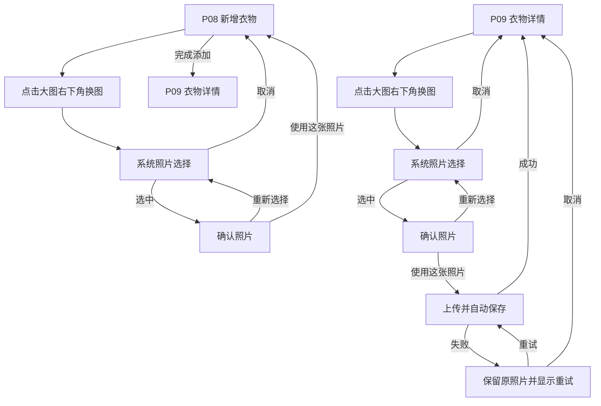

# 衣序 YISU：衣物详情直接编辑与自动保存设计规格

日期：2026-08-14
状态：已完成方案确认，待用户审阅书面规格

## 1. 背景与目标

当前 Gate A 将衣物查看与编辑拆分为 P09「衣物详情」和 P10「编辑衣物」。用户需要先从 P05 进入 P09，再点击“编辑”进入 P10，修改后点击“保存”。该链路步骤偏多，也让 P09 与 P10 重复展示同一批字段。

本次调整将 P09 改为“详情即编辑”的统一页面：用户从衣橱首页进入后，可直接修改任意字段；修改按照控件类型自动保存，不再进入独立编辑页，也不再使用统一保存按钮。P08「新增衣物」仍是创建流程，保留明确的“完成添加”操作。

目标：

- 减少查看与维护衣物信息之间的操作步骤。
- 让字段修改即时生效，同时提供明确但克制的保存反馈。
- 保证网络失败、连续编辑、页面返回和照片替换时不会丢失用户输入。
- 统一 P08 与 P09 的照片入口和字段选择组件，同时保持“新增”和“修改”的任务边界。

## 2. 已确认的产品决策

### 2.1 页面职责

- P05「衣橱首页」：衣物卡片点击后进入 P09。
- P08「新增衣物」：填写新衣物资料，满足必填条件后点击“完成添加”创建正式记录；不采用字段自动保存。
- P09「衣物详情」：同时承担查看和编辑职责；没有“编辑”和“保存”按钮。
- P10「编辑衣物」：从正式产品流程和开发页面清单中移除，功能合并至 P09；现有线框图和原型稿仅作为历史归档保留。
- P11「删除确认」：继续由 P09 的更多操作入口触发。

### 2.2 自动保存触发规则

- 单选、多选、日期及层级选择字段：用户完成选择后立即提交。
- 名称、品牌、价格和备注等输入字段：停止输入约 800 毫秒，或输入控件失去焦点、键盘收起时提交。
- 照片：在照片确认页点击“使用这张照片”后提交替换。
- 页面不显示统一保存按钮，也不显示“放弃未保存的更改”弹窗。
- 用户离开页面时若请求尚未完成，保留本地待同步修改并继续后台重试；再次进入时展示当前本地最新值及同步状态。

### 2.3 保存反馈

保存反馈采用页面级轻量状态，不抢占衣物图片与名称的视觉层级：

| 状态 | 触发条件 | UI 表现 | 用户操作 |
|---|---|---|---|
| 空闲 | 页面无待提交修改 | 不显示状态文案 | 正常查看和编辑 |
| 待提交 | 文本输入处于 800 ms 防抖窗口 | 保留本地最新值，不显示阻断层 | 可继续输入 |
| 保存中 | 请求已发出 | 显示“保存中…”及轻量进度图标 | 可继续编辑其他字段 |
| 已保存 | 服务端确认成功 | 短暂显示“已保存”，随后淡出 | 无需操作 |
| 保存失败 | 请求失败或超时 | 显示“保存失败，点击重试” | 点击重试或继续修改 |
| 待同步 | 离开页面时仍有未完成修改 | 本地保留，重新联网后自动重试 | 可继续使用 App |

失败不得回滚用户当前看到的有效输入。若同一字段产生多次连续修改，界面与最终服务端值必须以最后一次用户输入为准。

## 3. 页面与交互设计

### 3.1 P09 衣物详情

P09 沿用已确认的 V3B 视觉方向和纵向滚动结构：柔焦薰衣草背景、暖白信息卡片、真实衣物抠图、大圆角、轻阴影。两张信息卡不显示“重要信息”“其他信息”标题及二级标题，仅通过卡片、间距和字段顺序区分层级。

页面结构：

```text
┌──────────────────────────┐
│ 返回       衣物详情    更多 │
├──────────────────────────┤
│                          │
│       衣物顶部大图        │
│                    [换图] │
│                          │
├──────────────────────────┤
│ 衣物名称（可直接输入）     │
│ 简短描述 / 标签            │
│ 保存中… / 已保存 / 重试    │
├──────────────────────────┤
│ 分类          当前值   ›   │
│ 季节          当前值   ›   │
│ 收纳位置      当前值   ›   │
│ 备注          当前值   ›   │
├──────────────────────────┤
│ 颜色          当前值   ›   │
│ 品牌          当前值       │
│ 价格          当前值       │
│ 尺码          当前值   ›   │
│ 购买日期      当前值   ›   │
│ 材质          当前值   ›   │
│ 风格          当前值   ›   │
└──────────────────────────┘
```

交互规则：

- 名称、品牌、价格、备注点击后进入就地输入状态。
- 分类、季节、颜色、收纳位置、尺码、购买日期、材质、风格点击后打开现有选择面板或 iOS 原生选择控件。
- 选择面板的“取消”关闭面板且不产生更新；完成选择后立即更新本地页面并提交。
- P09 返回 P05 后，首页卡片展示最近一次成功保存的数据；仍待同步的本地值按统一数据源保留，不因返回丢失。
- 更多菜单保留“删除衣物”，继续进入 P11。

### 3.2 P08 新增衣物

- P08 继续使用完整长表单和现有字段分层。
- 图片、名称、分类、季节为创建衣物所需的必填条件。
- 主提交按钮文案由“保存”调整为“完成添加”。
- 必填条件未满足时按钮禁用，并在对应字段附近说明原因。
- 点击“完成添加”后进入创建中状态，成功后进入 P09；失败时保留全部已填内容与已选照片并允许重试。
- P08 的字段编辑不会提前创建正式衣物记录，也不使用 P09 的字段级自动保存。

### 3.3 换图入口与来源感知返回

P08 与 P09 的顶部大图右下角统一放置“换图”图标按钮。按钮使用相同图标库、尺寸、触控区域和视觉样式，文字含义通过无障碍标签补充。

两条流程：



P09 换图期间继续显示原照片；只有新照片上传并保存成功后才替换。失败不得留下空白图片或破图状态。

## 4. 数据与技术语义

### 4.1 字段级更新

客户端应使用字段级局部更新，或具备等效行为的更新接口。每次更新至少携带：

- 衣物记录标识。
- 被修改的字段及新值。
- 客户端修改序号或版本信息。
- 请求唯一标识，用于安全重试和防止重复提交。

### 4.2 连续修改与并发保护

- 同一字段连续提交时，旧请求的迟到响应不得覆盖更新的本地值。
- 客户端按字段维护最新修改序号；仅最后一次有效响应可以结束该字段的待同步状态。
- 服务端使用更新时间、版本号或等效的乐观并发控制，避免旧数据静默覆盖新数据。
- 不同字段可独立保存，但页面级状态需要汇总所有字段的保存结果。

### 4.3 本地待同步

- 保存失败或离开页面时尚未完成的修改，应写入本地待同步队列。
- 队列重试必须幂等，并在重新联网、App 回到前台或用户点击重试时触发。
- 若用户在重试前再次修改同一字段，只保留最新值作为最终目标。
- 用户退出账号前若仍有待同步内容，需要明确提示；本次设计不允许将一个账号的待同步内容提交到另一个账号。

### 4.4 字段校验

- P09 允许修改已有必填字段，但不允许将名称、分类或季节保存为无效值。
- 价格继续遵循：非必填、人民币元、数值不小于 0、最多两位小数。
- 尺码、季节、颜色、材质、风格和收纳位置继续使用既有选项及联动规则。
- 客户端校验失败不发起请求，并在字段附近显示可执行的修正提示。

## 5. 异常与边界条件

- 页面加载失败：保留返回操作，显示原因和“重新加载”。
- 单字段保存失败：其他已成功字段不回滚；失败字段保留本地值并可单独重试。
- 多字段同时保存：状态汇总优先级为“保存失败”高于“保存中”高于“已保存”。
- 用户快速返回：首页先读取共享本地数据；成功同步后保持同一值，失败时保留待同步标记。
- App 被系统终止：待同步数据必须可恢复，不依赖内存状态。
- 照片上传失败：继续显示原照片；新照片作为待重试资源处理。
- 记录已被删除或失去权限：停止重试，说明原因并返回衣橱首页。
- 可选字段清空：作为明确的空值更新提交；不得因为字段为空而误判为“未修改”。

## 6. 影响范围与交付顺序

### 6.1 必须修改

1. `AI数字衣橱-PRD-20260717.md`
   - 增加版本记录。
   - 修改 Gate A 页面范围、照片替换规则、衣物维护流程及验收标准。
   - 删除独立编辑页统一保存的旧规则。
2. `衣序YISU-GateA-AI原型设计需求-20260810.md`
   - 修改页面清单、流程图、P08–P10 定义、状态表、跳转和验收用例。
3. Figma `04 Wireframes`
   - 重制 P09 直接编辑与自动保存状态。
   - 为 P08、P09 增加换图按钮。
   - 将 P10 标记为合并至 P09，并从正式流程移除。
4. Figma `05 Prototype`
   - 连接 P05 → P09 直接编辑链路。
   - 移除 P09 → P10 及 P10 保存/取消链路。
   - 补充字段选择、自动保存反馈、失败重试、双入口换图及来源感知返回。
5. Figma 高保真页面
   - 更新 P09 可滚动稿与完整内容开发视图。
   - 后续 Gate B5 更新 P08 及相关状态。
6. 项目管理与交付材料
   - 更新 Figma 状态台账、设计规格、实施计划、交付 README 和项目交付管理包 Excel。

### 6.2 执行顺序

`PRD 与 AI 原型需求 → 04 Wireframes → 05 Prototype → P09/P08 高保真 → 状态台账与项目交付管理包`

上游文档和低保真交互先更新，避免高保真稿与开发说明继续引用已废弃的 P10 流程。

## 7. 验收标准

| 编号 | 前提 | 操作 | 预期 |
|---|---|---|---|
| AC-EDIT-01 | P05 有衣物卡片 | 点击卡片 | 进入 P09，可直接编辑字段，不出现“编辑”按钮 |
| AC-EDIT-02 | P09 正常加载 | 修改选择型字段 | 选择完成后立即出现保存反馈并成功更新 |
| AC-EDIT-03 | P09 正常加载 | 连续输入名称后停止约 800 ms | 只以最新输入为目标提交，成功后显示“已保存” |
| AC-EDIT-04 | 自动保存请求失败 | 继续浏览或返回 P05 | 本地修改不丢失，显示或保留待同步状态，可重试 |
| AC-EDIT-05 | 同一字段连续产生两次请求 | 后发请求先完成、旧请求后完成 | 最终界面和服务端值均为最后一次用户输入 |
| AC-EDIT-06 | P09 保存成功 | 返回 P05 | 首页对应卡片展示最新名称、分类或照片 |
| AC-EDIT-07 | P09 大图可见 | 点击换图后取消系统选择 | 返回 P09，原照片不变 |
| AC-EDIT-08 | P09 选择新照片 | 确认使用新照片 | 自动上传并保存；成功后替换，失败时保留原照片并可重试 |
| AC-ADD-01 | P08 必填字段未完成 | 查看“完成添加”按钮 | 按钮禁用并能定位缺失字段 |
| AC-ADD-02 | P08 必填字段完成 | 点击“完成添加” | 创建衣物并进入 P09；失败时表单内容不丢失 |
| AC-ADD-03 | P08 大图可见 | 点击换图并取消 | 返回 P08，当前已选照片和表单内容不变 |
| AC-FLOW-01 | 查看正式页面清单及原型 | 查找 P10 主流程入口 | 不存在正式入口；P10 仅以历史归档形式保留 |

## 8. 不在本次范围

- 不改变现有衣物字段集合及其选项。
- 不增加批量编辑、版本历史或撤销修改功能。
- 不新增搭配能力或 AI 自动识别流程。
- 不重做 P01 登录和 P05 首页视觉；P05 仅更新详情入口后的数据同步行为。
- 不删除已验收历史稿，历史稿统一标注，避免被误用为开发基线。

## 9. 交付检查

- 需求、页面清单、线框图、原型、高保真和项目计划对 P10 的状态描述一致。
- P08 与 P09 的换图图标、触控区域、返回目标和失败处理一致。
- P09 可滚动原型与完整内容开发视图字段数量和顺序一致。
- 原型中不存在通向已废弃 P10 的热点或死链。
- 自动保存的空闲、保存中、已保存、失败、待同步状态均有设计和验收证据。
- 文档中不再出现“编辑页点击保存后替换照片”“编辑取消返回详情”等冲突规则。
