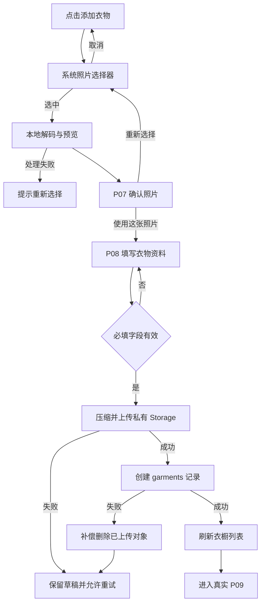

# 衣序 YISU：新增衣物与照片上传设计规格

日期：2026-09-03  
状态：已完成方案确认，待用户复核书面规格

## 1. 目标

实现 Gate A 的完整新增衣物闭环：登录用户从主导航进入添加入口，选择一张系统相册照片，预览并填写衣物资料，客户端压缩图片后上传至 Supabase 私有 Storage，再创建归属于当前用户和当前衣橱的 `garments` 记录。成功后刷新衣橱列表并进入真实 P09 衣物详情。

本功能必须保持当前认证、用户资料、默认衣橱、品牌视觉及主导航行为不变。

## 2. 范围

### 2.1 本期包含

- 系统 `PhotosPicker` 单张照片选择。
- 本地图片解码、方向归一、元数据移除、尺寸及质量压缩。
- P07 照片预览和重新选择。
- P08 新增衣物表单、校验、提交状态与失败重试。
- Supabase 私有 Storage bucket、对象权限策略及用户目录隔离。
- `garments` 数据表、索引、更新时间维护和行级权限策略。
- 衣物图片上传、补偿删除及私有图片读取。
- 真实衣物列表读取、创建成功刷新和进入 P09。
- 单元测试、Repository 测试、UI 测试与 pgTAP 权限测试。

### 2.2 本期不包含

- 相机拍摄、多图上传、图片裁剪、滤镜或 AI 识别。
- 后台上传、断点续传、跨启动草稿恢复或离线队列。
- 服务端图片变体、CDN 转码和缩略图生成。
- P09 换图、衣物编辑持久化和删除持久化；接口边界需为后续 CRUD 保留扩展空间。
- Edge Function。客户端直接使用 Supabase Swift SDK 完成 Storage 与 PostgREST 调用。

## 3. 用户流程



## 4. 表单与交互

### 4.1 字段

必填字段：

- 照片
- 名称
- 分类
- 季节

可选字段：

- 颜色
- 品牌
- 价格
- 尺码
- 购买日期
- 材质
- 风格
- 收纳位置
- 备注

### 4.2 提交规则

- P08 不执行字段级自动保存；用户点击“完成添加”后才创建正式记录。
- 必填字段无效时不发起网络请求，并在对应字段附近显示可执行的提示。
- 价格非必填，单位为人民币元，必须大于或等于 0，最多两位小数。
- 提交期间禁用重复提交；一次用户操作最多产生一次有效上传和一条衣物记录。
- 用户离开尚未提交且已产生内容的 P08 时，提示是否放弃；本期不跨页面或跨启动保存草稿。

## 5. 图片处理

- 输入：系统照片选择器返回的单张图片数据。
- 自动修正图片方向并输出标准像素方向。
- 重新编码时移除 EXIF、GPS 和其他原始元数据。
- 等比例缩放，最长边不超过 `2048 px`，不放大小图。
- 输出 JPEG，初始质量 `0.8`。
- 压缩后必须不超过 `5 MB`；超过时逐步降低质量，仍不满足则提示用户重新选择。
- 上传失败继续展示本地预览和全部表单字段，用户可主动重试。

图片处理逻辑必须独立于 SwiftUI View，以便使用确定性输入进行单元测试。

## 6. 数据模型

### 6.1 `garments` 表

核心字段：

| 字段 | 类型 | 约束 |
|---|---|---|
| `id` | `uuid` | 主键，由客户端预先生成 |
| `user_id` | `uuid` | 非空，引用 `auth.users(id)` |
| `wardrobe_id` | `uuid` | 非空，引用 `wardrobes(id)` |
| `image_path` | `text` | 非空，仅保存私有对象路径 |
| `name` | `text` | 非空，去除首尾空白后不可为空 |
| `category` | `text` | 非空 |
| `seasons` | `text[]` | 非空，至少一项 |
| `colors` | `text[]` | 可为空数组 |
| `brand` | `text` | 可空 |
| `price` | `numeric(12,2)` | 可空且不小于 0 |
| `size` | `text` | 可空 |
| `purchase_date` | `date` | 可空 |
| `materials` | `text[]` | 非空数组，默认 `{}`；至多 20 项，每项去空白后 1–20 字符 |
| `styles` | `text[]` | 非空数组，默认 `{}`；至多 20 项，每项去空白后 1–20 字符 |
| `storage_location` | `text` | 可空 |
| `notes` | `text` | 可空 |
| `created_at` | `timestamptz` | 非空，默认当前时间 |
| `updated_at` | `timestamptz` | 非空，自动维护 |
| `deleted_at` | `timestamptz` | 可空，首期用于软删除语义 |

数据库约束必须确保 `wardrobe_id` 与 `user_id` 属于同一用户，不能只依赖客户端传参。

### 6.2 Storage

- bucket：`garment-images`。
- bucket 为私有，不提供永久公开 URL。
- 对象路径：`{user_id}/{garment_id}/original.jpg`。
- 数据库只保存 `image_path`，不保存签名 URL。
- 当前用户只能对路径首段等于自身 `auth.uid()` 的对象执行读取、创建、更新和删除。

## 7. 客户端架构

### 7.1 组件边界

- `GarmentRepository`：读取当前衣橱衣物列表、创建衣物，并为后续更新与删除保留协议扩展点。
- `GarmentImageRepository`：上传、删除和读取私有图片。
- `SupabaseGarmentRepository`：通过 PostgREST 实现衣物数据操作。
- `SupabaseGarmentImageRepository`：通过 Supabase Storage 实现图片操作。
- `GarmentImageProcessor`：处理方向、缩放、元数据移除和 JPEG 输出。
- `AddGarmentStore`：持有选择图片、表单草稿、校验问题和提交状态，编排上传、建记录及补偿删除。
- `AddGarmentView` / P07 预览：只负责界面和用户事件，不直接调用 Supabase。

依赖继续由 `AppDependencies` 注入，UI 测试使用内存 Repository 和固定测试图片，不访问远程服务。

### 7.2 提交状态

```text
idle
→ processingPhoto
→ editing
→ validating
→ uploadingPhoto
→ creatingGarment
→ succeeded
```

失败状态：

- `photoProcessingFailed`
- `uploadFailed`
- `createFailed`

失败后保留当前会话内的本地图片预览和表单字段。用户再次点击“完成添加”时按正常流程重试。

## 8. 一致性与失败处理

- 客户端在上传前生成 `garment_id`，使 Storage 路径和数据库主键稳定对应。
- 先上传图片，再插入 `garments` 记录。
- 图片上传失败时不写数据库。
- 数据库插入失败时立即尝试删除刚上传的对象。
- 补偿删除失败只记录经过脱敏的诊断信息，不清空表单、不覆盖主要保存错误，也不向用户展示对象路径或内部错误。
- Supabase 原始错误统一映射为可执行用户文案，不展示数据库结构、策略或内部标识。
- 成功响应后将新衣物加入当前会话数据源，再导航到该衣物的 P09，避免返回 P05 时仍显示旧列表。

## 9. 安全规则

- 所有业务请求依赖 Supabase 当前认证会话。
- `garments` 的 SELECT、INSERT、UPDATE、DELETE 策略均要求 `auth.uid() = user_id`。
- 插入和修改还必须证明目标 `wardrobe_id` 属于当前用户。
- Storage 策略通过对象路径首段限制用户范围。
- 客户端不包含 `service_role`、数据库密码或永久签名 URL。
- 日志不得记录图片字节、访问令牌、用户邮箱、完整对象路径或 Supabase 原始响应体。

## 10. 测试策略

### 10.1 Swift 单元测试

- 图片横竖方向归一和最长边限制。
- JPEG 输出不超过 5 MB，重新编码后不保留输入元数据。
- 必填字段、价格精度和表单错误顺序。
- 提交期间拒绝重复操作。
- 上传失败不创建记录。
- 创建失败触发一次补偿删除并保留草稿。
- 成功创建刷新列表并返回新衣物。
- Repository 请求编码、解码及对象路径生成。

### 10.2 数据库与 Storage 测试

pgTAP 至少验证：

- 用户只能读取、创建、修改和删除自己的衣物。
- 用户不能使用其他用户的衣橱创建衣物。
- 用户不能通过修改 `user_id` 或 `wardrobe_id` 转移记录。
- 软删除记录不出现在默认列表查询中。
- Storage 对象路径策略阻止跨用户读写和删除。

### 10.3 UI 测试

- 点击主导航“添加衣物”进入照片选择入口。
- 注入测试照片后可进入 P07 和 P08。
- 缺少必填字段时不能提交。
- 上传中禁用重复提交并显示进度。
- 上传或创建失败时保留图片和表单，且可重试。
- 成功后进入真实 P09，返回 P05 可看到新衣物。

### 10.4 人工远程验证

- 使用真实 Supabase 账号完成新增衣物。
- Dashboard 的 `garments` 表出现一条归属于当前用户与当前衣橱的记录。
- `garment-images` 中对象路径符合用户目录规则，bucket 不公开。
- 第二账号不能读取第一账号的衣物记录或图片。
- 删除测试账号或测试记录时不会影响其他用户数据。

## 11. 验收标准

- 用户可从“添加衣物”完成单图选择、预览、表单填写和创建。
- 图片符合 2048 px、JPEG、5 MB 和元数据移除规则。
- 数据库只保存私有对象路径。
- 创建成功后 P05/P09 使用真实新衣物数据。
- 所有失败均不丢失当前页面输入，并能由用户主动重试。
- 跨用户数据与图片访问被 RLS 拒绝。
- 全量 iOS 构建、单元/UI 测试、Supabase pgTAP 和敏感信息扫描通过。
