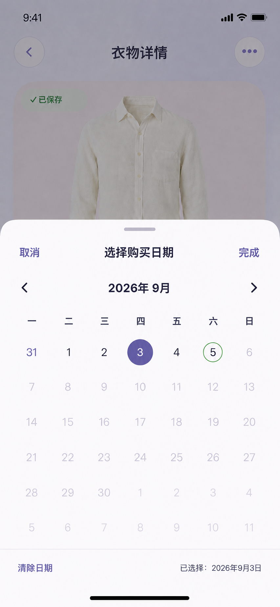

# 衣序 YISU：衣物字段选择与详情自动保存补全设计规格

日期：2026-09-05
状态：用户已确认，待实施

## 1. 背景与目标

真实设备验收发现四类缺口：第二次添加衣物沿用上一份草稿；颜色、尺码、材质、风格等选择型字段被错误实现为自由文本；购买日期仍使用原生日期控件；P09 的“自动保存”和换图只更新内存或显示占位状态，没有持久化到 Supabase。

本次补全以 2026-08-25 冻结规则为准：P08 一次性创建，P09 详情即编辑；文本字段停止输入约 800 ms 或失焦后保存，选择型字段完成选择后立即保存；失败不自动重试、不建立本地待同步队列，离开 P09 后以服务端最后成功值为准。

目标：

- 新增任务之间严格隔离草稿，流程内部仍能保留输入。
- P08/P09 复用同一套单选、多选、层级位置和自定义日期组件。
- P09 对文本、选择项和照片执行真实、顺序安全的字段级持久化。
- 多选字段以数组持久化，为筛选和后续扩展保留正确语义。

## 2. 架构与职责

```text
P08 / P09 页面
      ↓
共享字段选择组件
      ↓
AddGarmentStore / GarmentDetailStore
      ↓
GarmentRepository / GarmentImageRepository
      ↓
Supabase Database / Private Storage
```

共享组件：

- `GarmentSingleSelectSheet`：分类、尺码；点击选项立即完成。
- `GarmentMultiSelectSheet`：季节、颜色、材质、风格；临时选择，点击“完成”生效。
- `GarmentStorageLocationSheet`：两级位置选择及“其他”输入。
- `YISUPurchaseDateSheet`：自定义月历、禁止未来日期、支持清除。
- `GarmentFieldOptions`：集中定义合法选项、顺序和分类联动。

`AddGarmentStore` 负责 P08 本地草稿、校验和一次性创建；`GarmentDetailStore` 负责 P09 服务端值、页面编辑值、字段保存序列、换图及错误状态。页面不直接调用 Supabase。

## 3. P08 草稿生命周期

从 P05 点击“添加衣物”时开始一个新任务，重置照片、字段、校验错误和提交状态。以下操作保留当前草稿：重新选图、取消系统选择器、P07/P08 内部返回、校验失败、上传失败和创建失败。

创建成功后当前任务结束；下一次从 P05 进入时使用全新空草稿。未提交返回 P05 时保留放弃确认，确认放弃后清空草稿。P08 所有字段只更新本地草稿，点击“完成添加”后才上传并创建记录。

字段顺序保持：图片、名称、分类、季节、收纳位置、备注、颜色、品牌、价格、尺码、购买日期、材质、风格。图片、名称、分类、季节必填，其余可选。

## 4. 统一选择面板

所有 Sheet 使用暖白表面、大圆角、轻阴影、顶部拖动条和至少 `44×44 pt` 的操作区；打开时回显当前值，支持 Dynamic Type 与 VoiceOver。

### 4.1 单选

分类和尺码点击选项后立即生效并关闭。P08 只更新草稿；P09 立即自动保存。选中态同时使用勾选图标与品牌色。

分类固定为：上衣、裤子、连衣裙、外套、鞋履、包袋、配饰、其他。

### 4.2 多选

季节、颜色、材质和风格在 Sheet 内维护临时值；“取消”丢弃修改，“完成”统一写回。顶部显示“已选 X 项”，无变化时禁用“完成”。四季全选时摘要显示“四季”，数据库仍保存四项。

季节：春季、夏季、秋季、冬季。

颜色：黑色系、白色系、灰色系、红色系、橙色系、黄色系、绿色系、蓝色系、紫色系、粉色系、棕色系、裸色系、金色系、银色系、透明/无色、彩色/多色、其他。

材质：棉、涤纶、尼龙、牛仔布、麻、丝、羊毛、羊绒、莫代尔、氨纶、腈纶、毛皮、羽绒、丝绒、雪纺、蕾丝、欧根纱、薄纱、其他。

风格：简约、通勤、休闲、运动、复古、文艺、中性、甜美、优雅、街头、学院、度假、性感、民族、其他。

### 4.3 “其他”输入

选择“其他”后展开自定义输入。自定义值可与预设值共同保存；去除首尾空格、忽略大小写去重、空白不保存，单项最多 20 个字符。取消“其他”时清除本次未提交的自定义值。数据库保存实际自定义值，不单独保存“其他”占位值。

## 5. 分类与尺码联动

- 上衣、裤子、连衣裙、外套：XS、S、M、L、XL、XXL、其他。
- 鞋履：35–45，每 0.5 一个码数，并提供“其他”。
- 包袋、配饰、其他：隐藏尺码并保存为空。

服装分类之间切换可保留尺码；服装与鞋履互换或切换到不适用分类时，先提示会清除旧尺码。取消时分类和尺码都不变化；确认时将分类与清空尺码作为一次逻辑更新，避免部分成功。

## 6. 收纳位置

第一级：主卧衣橱、次卧衣橱、玄关柜、衣帽间、储物柜、其他。
第二级：上层、中层、下层、抽屉、挂衣区、叠放区。

两级均非必填，可只选第一级；第二级在已选第一级后出现。“其他”允许自定义。展示格式为“主卧衣橱 · 上层”。本期继续将完整值写入 `storage_location`，组件内部保留结构化值。“清除位置”经完成确认后保存为空。

## 7. 自定义购买日期



规则：

- 禁止选择未来日期，支持清除日期，周一为每周第一列。
- 有已有日期时定位并选中；没有时定位当前月份但不自动选中今天。
- 左右箭头切换月份；不能进入全部日期都在未来的月份。
- 月首尾显示相邻月份补位日期；可选补位日期点击后切换月份并选中，未来补位日期禁用。
- 普通可选日期（含周末）统一使用深灰紫；今天为鼠尾草绿细环；已选为品牌紫实心圆与白字；可选补位日期使用中等灰紫；未来日期使用低对比度浅灰。
- Sheet 内维护临时值；“取消”不修改，“完成”写回。“清除日期”只清空临时值，仍需点击“完成”。
- P08 完成后更新草稿；P09 完成后立即自动保存。

## 8. P09 字段级自动保存

P09 不显示“编辑”或统一“保存”按钮。名称、品牌、价格、备注就地输入；其他字段使用共享 Sheet。

文本字段立即更新页面，停止输入 800 ms 后提交；失焦或键盘收起时取消防抖并立即提交。无变化不提交。名称不能为空；价格必须非负且最多两位小数，客户端校验失败不发送请求。

每个字段维护页面值、服务端最后成功值、修改序号、当前请求、待提交最新值和错误。同一字段串行提交：请求进行中产生的新值进入最新值槽，前一请求结束后只提交最新值，旧响应不能覆盖新输入。不同字段使用局部 PATCH，可并行保存。

页面状态汇总优先级：

```text
保存失败 > 保存中 > 待提交 > 已保存 > 空闲
```

“已保存”约 1.5 秒后淡出。失败保留当前会话输入并提供重试，但不自动重试、不建立本地待同步队列；再次修改按正常规则提交。保存成功后更新 `GarmentStore`，P05 展示最后成功的名称、分类、季节和图片。失败值不写入 P05；重新进入 P09 时读取服务端最后成功值。

## 9. P09 换图

换图期间持续显示原图。用户确认新照片后处理 JPEG，并上传至新私有路径：

```text
<user_id>/<garment_id>/<revision_id>.jpg
```

上传成功后更新 `garments.image_path`；数据库成功后切换 P09/P05 图片并尝试删除旧对象。数据库失败则删除新对象、保留旧图和当前会话的新图草稿，并提供主动重试。旧图删除失败不回滚已成功的新图，只记录脱敏诊断。取消系统选择器或确认页时原图不变。

## 10. 数据模型与 Repository

数据库将单值字段升级为数组：

```text
material text  → materials text[] not null default '{}'
style text     → styles text[] not null default '{}'
```

已有 `null` 迁移为空数组，已有字符串迁移为单元素数组。颜色继续使用 `colors text[]`。数组增加数量及单项长度约束。Swift `Garment`、`NewGarment` 和 Draft 统一使用 `[String]`。

`GarmentRepository` 增加：

```swift
func fetchGarment(id: UUID) async throws -> Garment
func updateGarment(id: UUID, changes: GarmentChanges) async throws -> Garment
func deleteGarment(id: UUID) async throws
```

`GarmentChanges` 只编码明确变化的字段，并能区分未修改、保存 `null` 和保存空数组。RLS 继续限制当前用户自己的记录。

## 11. 删除与错误处理

删除从 P09 更多菜单进入确认面板；确认后禁用重复操作。成功后从 `GarmentStore` 移除并返回 P05，失败停留 P09 并允许重试。本次不扩展搭配/OOTD 历史语义。

P08 上传或创建失败保留草稿；创建失败补偿删除新对象，补偿失败不覆盖主要错误。P09 单字段失败不阻塞其他字段；权限失效或记录不存在时停止保存并提供返回。账号切换时销毁旧账号详情 Store，防止跨账号提交。

## 12. 测试与远端验收

单元测试覆盖草稿重置/保留、单选与多选提交语义、“其他”校验、尺码联动、日期禁用/跨月/清除、文本防抖、失焦保存、同字段乱序保护、不同字段独立保存、失败不自动重试、换图补偿、数组迁移与编解码。

UI 测试覆盖连续新增空表单、每个 Sheet 的打开/回显/取消/完成、分类尺码确认、自定义日期状态、P09 文本和选择型保存、成功值同步 P05、失败值不污染 P05，以及换图取消/成功/失败。

Supabase 验收覆盖数组迁移无损、局部更新、RLS 双账号隔离、私有图片替换、数据库失败后无多余对象和删除后无孤立图片。

## 13. 文档一致性

实施时同步更新 PRD、需求清单、AI 原型需求、自动保存规格和照片上传规格。删除仍描述“自动重试、本地待同步队列、退出同步确认”的过时 Gate A 规则；将购买日期从原生控件更新为本规格确认的自定义日历，并明确材质、风格为数组。

## 14. 范围排除

- 不新增 AI 识别、相机、批量编辑、撤销、版本历史或离线队列。
- 不重做 P05 视觉，只同步成功保存的数据。
- 不建立通用动态表单引擎。
- 不提交开发者个人签名、证书或 Scheme 本地设置。
