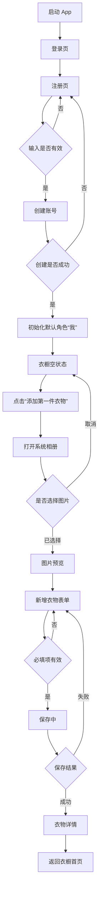
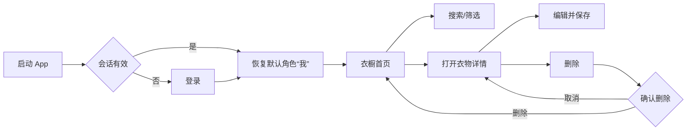

# 衣序 YISU — Gate A AI 原型设计需求文档 v1.0

> 用途：将本文档交给 Figma Make、Visily、Uizard 等 AI 原型工具，生成 iPhone App 的低保真流程原型、关键页面高保真稿和可点击交互原型。

日期：2026-08-10｜平台：iPhone｜阶段：MVP Gate A｜认证方式：邮箱 + 密码

## 0. 变更记录

| 版本 | 日期 | 变更范围 | 原因 |
|---|---|---|---|
| v1.0 | 2026-08-10 | 首版 Gate A 原型需求 | 将已确认的 Sprint 设计轨道整理为 AI 工具可执行输入 |
| v1.1 | 2026-08-12 | Gate A 角色范围收缩为唯一默认角色“我” | 本轮不实现“宝宝”、第二角色及多角色切换 |

## 1. 使用方法

不要要求 AI 一次完成全部设计。推荐分四轮执行：

1. 先提交第 12 节“总提示词”，生成页面结构和主流程。
2. 再按第 13 节逐轮生成低保真、视觉规范、关键页高保真和交互连接。
3. 用第 14 节纠偏提示词删除越界功能、Web 化布局和不符合 iOS 的控件。
4. 最后按照第 11 节逐项验收；未通过的项目单独提示 AI 修改。

所有界面文案使用简体中文。设计稿中的图层、Frame 和组件名称使用清楚的中文或英文语义名称，不使用 `Frame 123`、`Group 8` 等无意义名称。

## 2. 事实清单与设计边界

| ID | 已确认事实 | 来源 |
|---|---|---|
| F1 | 产品品牌为“衣序 YISU” | 已有 PRD 与项目交付管理包 |
| F2 | 产品是面向个人用户的 iPhone 原生 App | 已有 PRD、Xcode 工程与 iOS 原生基线 |
| F3 | 当前阶段只设计 Gate A | 2026-08-10 至 2026-08-21 Sprint |
| F4 | 当前登录方式为邮箱 + 密码 | 用户确认及 DEC-006 |
| F5 | Gate A 主链路是注册/登录、默认角色、私密衣橱、带图衣物 CRUD | 最新 WBS、里程碑与 Sprint Backlog |
| F6 | 图片来源仅为系统相册；相机拍摄暂不纳入本轮 | 最新 WBS 与 Sprint Backlog |
| F7 | 图片和衣物数据默认私密，不允许跨用户访问 | Gate A 安全门禁 |
| F8 | 原型须覆盖正常、加载、空白、错误、无结果和删除确认状态 | Sprint 设计验收标准 |
| F9 | 品牌气质为年轻、简洁、温馨、有秩序 | 已有品牌决策 |
| F10 | 客户端实现技术为 SwiftUI | iOS 原生技术基线 |

### 2.1 本轮必须包含

- 邮箱注册、登录、退出和会话恢复的界面流程。
- 自动初始化并恢复唯一默认角色“我”；本轮不提供第二角色、角色新增/编辑或切换能力。
- 衣橱首页、搜索、单一品类筛选和默认按最新添加排序。
- 系统相册选图后的预览、衣物新增表单、保存反馈。
- 衣物详情、编辑和删除。
- 加载、空白、错误、无搜索结果、按钮禁用、表单校验和删除确认。
- 低保真流程、最小 UI 规范、关键页面高保真和可点击原型。

### 2.2 本轮禁止加入

- Sign in with Apple、微信登录、手机号登录或短信验证码。
- 相机拍摄、画质检测、AI 分类、去背景、AI 推荐或 AI 处理中页面。
- 离线队列、搭配业务、OOTD、分享、会员、支付、社区、虚拟试穿；主导航不保留“搭配”占位入口。
- TestFlight、App Store、运营后台或 Web 管理端页面。
- 未经要求自行扩展的四栏或更多底部导航。Gate A 使用已确认的三栏底部导航：衣橱、添加衣物、我的。
- “宝宝”、第二角色、多角色列表、角色新增/编辑/删除与角色切换入口。

## 3. 产品目标与目标用户

### 3.1 产品目标

让用户以尽可能低的操作负担，把现实衣物保存到一个私密、可查找、可维护的数字衣橱中。

Gate A 原型需要验证：

- 用户能理解如何注册并进入衣橱。
- 用户能在没有教学说明的情况下添加第一件衣物。
- 用户能找到、查看、编辑和删除已添加衣物。
- 用户能理解本轮衣物均属于默认角色“我”，并感受到数据默认私密。
- 错误或失败发生时，用户知道发生了什么以及下一步怎么做。

### 3.2 目标用户

- 喜欢整理衣物、希望减少重复购买的年轻女性。
- 对复杂软件不熟悉，希望操作直观、反馈明确的普通 iPhone 用户。

### 3.3 设计原则

- 内容优先：衣物图片是衣橱界面的视觉主角。
- 一屏一主任务：每个页面最多突出一个主要操作。
- 先完成再丰富：不要在 Gate A 添加未确认的高级功能。
- 私密可信：避免社交化表达，不使用公开、关注、点赞等暗示。
- 失败可理解：禁止只显示“出错了”；说明问题并提供明确操作。
- 原生可实现：优先采用 SwiftUI 和 iOS 系统组件可以直接实现的模式。

## 4. 信息架构与用户流程

### 4.1 页面结构

```text
衣序 YISU
├── 账号
│   ├── 登录
│   ├── 注册
│   ├── 忘记密码（邮箱重置链接）
│   ├── 服务条款
│   └── 隐私政策
├── 角色
│   ├── 默认角色初始化
│   └── 当前衣橱身份说明
└── 衣橱
    ├── 衣橱首页
    ├── 搜索与单一品类筛选
    ├── 相册选图与图片预览
    ├── 新增衣物
    ├── 衣物详情
    ├── 编辑衣物
    └── 删除确认
```

### 4.2 首次用户主流程



### 4.3 已有用户流程



## 5. 页面与状态总清单

| ID | 页面/覆盖层 | 低保真 | 高保真 | 必须状态 |
|---|---|---:|---:|---|
| P01 | 登录页 | 是 | 是 | 默认、输入中、校验失败、登录中、认证失败 |
| P02 | 注册页 | 是 | 是 | 默认、密码不符合、邮箱已存在、提交中、失败 |
| P03 | 默认角色初始化 | 是 | 否 | 创建中、创建失败、成功跳转 |
| P04 | 当前衣橱身份面板 | 是 | 是 | 当前角色“我”、加载、加载失败 |
| P05 | 衣橱首页 | 是 | 是 | 加载、空白、有数据、加载失败 |
| P06 | 搜索与筛选 | 是 | 是 | 输入中、有结果、无结果、清空条件 |
| P07 | 相册选图/预览 | 是 | 是 | 系统选择器、取消、已选择、重新选择 |
| P08 | 新增衣物 | 是 | 是 | 默认、校验失败、保存中、保存失败 |
| P09 | 衣物详情 | 是 | 是 | 正常、加载、加载失败 |
| P10 | 编辑衣物 | 是 | 是 | 默认、已修改、保存中、保存失败 |
| P11 | 删除确认 | 是 | 是 | 确认、删除中、删除失败 |
| P12 | 全局错误反馈 | 是 | 否 | 非阻断提示、可重试提示 |
| P13 | 忘记密码 | 是 | 是 | 默认、发送中、邮件已发送、发送失败 |
| P14 | 设置新密码 | 是 | 是 | 默认、校验失败、提交中、成功、链接失效 |
| P15 | 服务条款 | 是 | 否 | 纯文本、加载失败 |
| P16 | 隐私政策 | 是 | 否 | 纯文本、加载失败 |

## 6. 页面级原型要求

### P01 登录页

**目标**：让已有账号快速登录，并让新用户明确找到注册入口。

**内容与控件**：

- 顶部留白区域展示简洁的衣架或衣物秩序符号、品牌“衣序 YISU”。
- 副文案：“让每件衣服，都井然有序”。
- 邮箱输入框，标签“邮箱”，键盘类型为 Email。
- 密码输入框，标签“密码”，支持显示/隐藏密码。
- 主按钮“登录”；输入无效或提交中时禁用。
- 次级文字按钮“还没有账号？注册”。
- 辅助入口“忘记密码”；点击进入 P13，通过注册邮箱接收密码重置链接。
- 底部展示默认勾选的协议复选框，文案为“我已阅读并同意 服务条款 与 隐私政策”。
- “服务条款”“隐私政策”使用品牌强调色，可分别点击进入 P15、P16 独立纯文本页面。
- 取消勾选后登录按钮禁用；重新勾选后按原表单校验规则恢复按钮状态。

**校验与反馈**：

- 邮箱为空：“请输入邮箱”。
- 邮箱格式无效：“请输入有效的邮箱地址”。
- 密码为空：“请输入密码”。
- 认证失败：“邮箱或密码不正确，请重新输入”。不要暴露账号是否存在。
- 登录时按钮显示进度及“正在登录…”，并阻止重复提交。

**跳转**：登录成功 → P03 或 P05；点击注册 → P02。

### P13 忘记密码

- 页面标题“忘记密码”，说明“输入注册邮箱，我们会发送密码重置链接”。
- 仅包含邮箱输入框和主按钮“发送重置邮件”，左上角返回登录。
- 邮箱无效时原地提示；发送中禁用重复提交；无论账号是否存在均使用中性成功文案，避免泄露账号状态。
- 发送成功显示“邮件已发送”，并提供 60 秒后重新发送和“返回登录”。
- 邮件链接进入 P14；发送失败保留邮箱并提供重试。

### P14 设置新密码

- 包含“新密码”“确认新密码”，密码至少 8 位且两次输入一致。
- 提交成功显示“密码已更新”，随后返回 P01；链接失效时提供“重新发送重置邮件”。

### P15 服务条款 / P16 隐私政策

- 两页均为独立的原生导航纯文本页面，顶部标题与返回按钮固定，正文可滚动。
- 原型使用结构化占位正文，不视为正式法律文本；上线前须由法务或业务负责人提供并确认正式版本。

### P02 注册页

**目标**：以最少字段完成账号创建。

**内容与控件**：

- 导航标题“创建账号”，左上角系统返回按钮。
- 邮箱、密码、确认密码三个字段。
- 密码规则在字段下方常驻显示：“至少 8 位”。不要自行增加未确认的复杂规则。
- 主按钮“创建账号”。
- 辅助文案说明衣物照片和数据默认私密。

**校验与反馈**：

- 两次密码不同：“两次输入的密码不一致”。
- 邮箱已注册：“该邮箱暂时无法注册，请尝试登录或使用其他邮箱”。
- 网络/服务失败：“账号创建失败，请检查网络后重试”。
- 注册成功后展示短暂成功反馈，进入 P03。

### P03 默认角色初始化

**目标**：向用户解释本轮账号使用唯一默认角色“我”，并自动建立该角色。

**界面**：居中进度状态，标题“正在准备你的衣橱”，说明“我们正在创建默认角色‘我’”。成功后自动进入 P05，不要求用户填写额外资料。

**失败**：显示“衣橱初始化失败”和“重试”按钮；不把用户送回注册页。

### P04 当前衣橱身份面板

**目标**：明确当前查看的是默认角色“我”的衣橱，不暗示本轮支持多角色切换。

**交互形式**：从底部弹出的 iOS Sheet，用于说明当前衣橱身份；不设计为切换器或 Web 下拉菜单。

**内容**：

- 标题“当前衣橱”。
- 仅显示默认角色“我｜本人”并带对勾。
- 说明“本轮仅使用默认衣橱”。
- 提供关闭入口；加载失败时显示“角色加载失败”和“重新加载”。
- 本轮不提供第二角色、角色新增、编辑、删除或切换流程。

### P05 衣橱首页

**目标**：让用户清楚看到当前角色的衣物，并能快速新增、搜索和筛选。

**布局**：

```text
┌──────────────────────────────┐
│ 我的衣橱⌄              搜索  │
│ 24 件衣物                    │
├──────────────────────────────┤
│ [全部] [上衣] [裤子] [外套]… │
├──────────────────────────────┤
│ [衣物图]   [衣物图]   [衣物图]│
│ 白色衬衫   牛仔裤     米色外套│
│ 上衣       裤子       外套    │
│                              │
│ 三列图片卡片网格              │
├──────────────────────────────┤
│                    ＋ 添加衣物│
└──────────────────────────────┘
```

**规则**：

- 标题固定显示“我的衣橱”；如需说明归属，可点击打开 P04 当前衣橱身份面板。
- 整个 App 主层级使用底部三栏导航：衣橱、添加衣物、我的；进入时默认选中“衣橱”。P05 的加载、空白、有数据、分类筛选和加载失败状态均显示该导航。
- 点击中间圆形加号“添加衣物”直接进入 P07 照片选择与新增衣物流程；不提供“搭配”占位页或搭配业务入口。
- 点击“我的”进入基础账号页，展示账号邮箱、当前衣橱“我 · 本人”、账号与安全、关于衣序 YISU 和退出登录。
- P06 搜索及 P07–P11 选图、录入、详情、编辑、删除等子流程不显示底部导航；返回 P05 后恢复原选中状态。
- 顶部只保留一个搜索入口和横向滚动的单一品类筛选。
- 品类固定包含：全部、上衣、裤子、外套、裙子、鞋子、配饰、其他；使用横向滚动的单选标签。
- 选择某一品类后，仅显示该品类衣物，并同步更新数量文案；例如选择“上衣”后只展示上衣卡片。
- 默认按创建时间倒序。
- 衣物使用三列图片卡片；显示图片、名称和主品类，名称与品类文字区必须保留足够高度，不得截断或被下一行卡片遮挡。
- 中间导航项使用 `60×60 pt` 圆形加号作为“添加衣物”主操作，不再另设右下角浮动按钮。
- 点击卡片 → P09；点击添加 → P07；点击搜索 → P06。

**状态**：

- 加载：使用三列骨架卡片，不用全屏旋转指示器遮挡页面。
- 空白：衣架插图、标题“衣橱还是空的”、说明“从相册添加第一件衣物吧”、主按钮“添加第一件衣物”。
- 失败：标题“衣橱加载失败”、说明和“重新加载”按钮。

### P06 搜索与单一品类筛选

**目标**：按衣物名称快速查找，并允许一次选择一个品类。

**要求**：

- 使用 iOS 搜索框，placeholder 为“搜索衣物名称”。
- 输入时实时更新结果，并提供系统清除按钮。
- 品类保持单选；选择新项替换旧项。
- 无结果：显示“没有找到相关衣物”，并提供“清空搜索和筛选”。
- 取消搜索后返回完整衣橱首页，键盘收起。
- 不设计品牌、颜色、季节等组合筛选面板。

### P07 相册选图与图片预览

**目标**：让用户从系统相册选择一张衣物图片并确认。

**要求**：

- 点击添加后进入 iOS 系统 PhotosPicker，原型中用系统相册选择器示意，不自创图片权限弹窗。
- 只允许选择一张图片。
- 取消系统选择器后返回原页面，不创建空记录。
- 选图后展示大幅预览、按钮“使用这张照片”和“重新选择”。
- 不展示裁剪、滤镜、相机、画质检测或 AI 去背景功能。

### P08 新增衣物

**目标**：保存一件带图衣物，并建立便于查找和整理的完整衣物档案。

**字段**：

| 字段 | 必填 | 控件 | 示例 |
|---|---:|---|---|
| 图片 | 是 | 已选图片预览 | 白色衬衫图片 |
| 名称 | 是 | 单行文本框 | 白色亚麻衬衫 |
| 分类 | 是 | iOS Picker/选择列表 | 上衣 |
| 季节 | 是 | 多选列表 | 春季、夏季；四项全选显示“四季” |
| 收纳位置 | 否 | 房间→家具→具体位置三级单选 | 卧室-衣柜-3层；每一级均可不选 |
| 备注 | 否 | 多行文本框 | 适合春夏通勤 |
| 颜色 | 否 | 多选列表 | 白色系、裸色系 |
| 品牌 | 否 | 单行文本框 | 无印良品 |
| 价格 | 否 | 数字输入框 | 299.00 元；≥0，最多两位小数 |
| 尺码 | 否 | 联动选择框 | 服装 XS–XXL；鞋子 35–45、步长 0.5 |
| 购买日期 | 否 | iOS 原生日期选择器 | 2026-08-08 |
| 材质 | 否 | 多选列表 | 麻、棉 |
| 风格 | 否 | 多选列表 | 简约、通勤 |

**交互**：

- 导航标题“添加衣物”，左侧“取消”，右侧或底部主按钮“保存”；页面为纵向滚动长表单。
- 字段依次完整展开。重要信息为图片、名称、分类、季节、收纳位置、备注；其他信息为颜色、品牌、价格、尺码、购买日期、材质、风格。两组通过标题、留白、分割线或浅色背景形成层级，不折叠。
- 名称、分类或季节缺失时保存按钮禁用；用户触发后也要在字段附近给出原因。
- 颜色支持多选：黑色系、白色系、灰色系、红色系、橙色系、黄色系、绿色系、蓝色系、紫色系、粉色系、棕色系、裸色系、金色系、银色系、透明/无色、彩色/多色、其他。
- 尺码随分类联动：鞋子显示 35–45、每 0.5 一个码数；其他服装显示 XS、S、M、L、XL、XXL；配饰、其他等不适用分类隐藏尺码字段。
- 材质支持多选：棉、涤纶、尼龙、牛仔布、麻、丝、羊毛、羊绒、莫代尔、氨纶、腈纶、毛皮、羽绒、丝绒、雪纺、蕾丝、欧根纱、薄纱、其他。
- 风格支持多选：简约、通勤、休闲、运动、复古、文艺、中性、甜美、优雅、街头、学院、度假、性感、民族、其他。
- 保存中锁定重复提交，显示“正在保存…”。
- 保存失败时保留已填写内容和图片，显示原因和“重试”。
- 保存成功 → P09，不出现 AI 识别或处理中步骤。

### P09 衣物详情

**目标**：展示衣物信息并提供编辑和删除入口。

**内容**：大图及 P08 已保存的全部档案字段；未填写的可选字段不显示；补充添加日期。右上角“编辑”；更多菜单中放“删除衣物”。

**规则**：

- 图片是页面第一视觉层级。
- 不展示点赞、浏览量、分享、AI 标签、推荐搭配。
- 编辑 → P10；删除 → P11。
- 加载失败时显示返回和重试，不展示空白详情。

### P10 编辑衣物

复用 P08 的全部字段、分层和联动规则，标题改为“编辑衣物”。进入时显示现有值；有修改后才启用“保存”。离开未保存页面时弹出：“放弃未保存的更改？”按钮为“继续编辑”和“放弃更改”。保存失败必须保留修改内容。

### P11 删除确认

使用 iOS Alert 或 Confirmation Dialog：

- 标题：“删除这件衣物？”
- 说明：“删除后将无法恢复。”
- 破坏性按钮：“删除”。
- 取消按钮：“取消”。
- 删除进行中禁止重复操作。
- 删除失败：“删除失败，请重试”；用户仍停留在详情页。
- 删除成功返回衣橱首页，并从列表移除对应卡片。

## 7. 全局交互与文案规则

### 7.1 导航

- 使用 iOS NavigationStack 的层级体验：系统返回、标题、Sheet、Alert。
- App 主层级使用 iOS 三栏 Tab Bar：衣橱、添加衣物、我的；衣橱默认选中，中间圆形加号直接启动添加衣物流程。子流程使用 NavigationStack 或模态呈现，不重复显示 Tab Bar。
- 不使用浏览器式侧边栏、悬浮网页导航或桌面端面包屑。
- 同一任务内返回时保留合理的搜索条件和滚动位置。
- 模态任务必须有明确取消方式；危险操作必须二次确认。

### 7.2 表单和键盘

- 点击键盘“下一项”移动到下一个字段，最后一项可提交或收起键盘。
- 错误信息显示在对应字段附近，不只使用顶部 Toast。
- 错误不能仅用红色表达，同时使用文字或图标。
- 提交中禁用重复点击，但用户已输入的数据不可消失。

### 7.3 用户文案

- 使用简短、温和、具体的简体中文。
- 按钮以动作开头，如“登录”“创建账号”“添加衣物”“重新加载”。
- 避免技术词：RLS、Bucket、CRUD、Repository、Migration、Supabase。
- 不使用“系统异常”“未知错误”作为唯一说明。

## 8. 视觉方向与最小 UI 规范

### 8.1 视觉关键词

年轻、清爽、温暖、克制、有秩序、轻生活方式感。整体像一个安静的私人衣帽间，而不是电商商城或社交社区。

### 8.2 建议视觉语言

- 背景：暖白或非常浅的中性色。
- 品牌强调色：低饱和鼠尾草绿、青绿色或相近的沉静色；只选一个主强调色。
- 文字：高对比深灰；次级文字保持可读，不使用过浅灰色。
- 图片卡片：圆角适中、留白充足、阴影轻微或无阴影。
- 字体：使用 iOS 系统字体风格；不要使用花体作为正文。
- 图标：优先采用 SF Symbols 风格，线条粗细一致。
- 间距：采用 4/8 pt 体系，主要页面水平边距建议 16–24 pt。

颜色值可以由 AI 给出第一版建议，但必须形成明确的 Color Token，不要在不同页面随意变化。

### 8.3 必须建立的组件

- Primary Button：默认、按下、禁用、加载。
- Secondary/Text Button：默认、按下、禁用。
- Text Field：默认、聚焦、已填写、错误、禁用。
- Secure Field：显示/隐藏密码状态。
- Garment Card：图片、名称、品类、占位图。
- Category Chip：默认、选中、按下。
- Empty State、Error State、Loading Skeleton。
- Navigation Bar、Bottom Sheet、Alert。

## 9. iOS 与无障碍约束

- 以当前主流 iPhone 竖屏尺寸设计，内容遵守顶部和底部安全区。
- 可点击区域至少 44 × 44 pt；自定义按钮必须有按下反馈。
- 每个页面最多突出一到两个主操作，危险操作不得采用主按钮视觉。
- 支持 Dynamic Type：放大字号时不截断关键文案和按钮。
- VoiceOver 阅读顺序与视觉顺序一致；图片、图标按钮和错误提示需要语义标签。
- 不以颜色作为唯一状态区分；选中、错误和禁用状态同时有形状、文字或图标变化。
- 支持浅色模式；深色模式不是本轮高保真必交付项，但颜色 Token 应可扩展。
- 使用系统相册选择器、Alert、Sheet、搜索框等原生交互习惯。

参考：[Apple Human Interface Guidelines](https://developer.apple.com/design/human-interface-guidelines)；Apple 建议按钮点击区域至少为 44 × 44 pt，并为自定义按钮提供按下状态。

## 10. 原型示例数据

### 10.1 账号与角色

- 测试邮箱：`hello@yisu.example`
- 默认角色：我｜类型：本人

### 10.2 衣物

| 名称 | 品类 | 备注 |
|---|---|---|
| 白色亚麻衬衫 | 上衣 | 春夏通勤 |
| 直筒牛仔裤 | 裤子 | 日常百搭 |
| 米色短款风衣 | 外套 | 换季穿着 |
| 黑色针织连衣裙 | 连衣裙 | 简洁正式 |
| 白色运动鞋 | 鞋履 | 轻便舒适 |
| 棕色托特包 | 包袋 | 可放电脑 |

图片使用无品牌 Logo、背景干净的单件衣物占位图。不得使用真人脸部、儿童真实照片或版权来源不明的商业图片。

## 11. 原型交付与验收标准

### 11.1 交付物

1. 用户流程图与页面清单。
2. P01–P12 全部低保真页面与状态。
3. P01、P02、P04–P11 的关键页面高保真稿。
4. 颜色、字体、间距和核心组件规范。
5. 可点击原型，至少覆盖三条验收旅程。
6. 页面与组件有清楚命名，设计变量和组件可编辑。

### 11.2 可点击旅程

| # | 前提 | 操作 | 预期 |
|---|---|---|---|
| AC-PROTO-01 | 新用户在登录页 | 注册并完成默认角色初始化 | 到达衣橱空状态，可看见添加第一件衣物入口 |
| AC-PROTO-02 | 衣橱为空 | 选图、填写名称和品类并保存 | 到达衣物详情，返回首页后出现新卡片 |
| AC-PROTO-03 | 衣橱已有数据 | 搜索名称并选择品类 | 结果正确，无结果时可一键清空条件 |
| AC-PROTO-04 | 进入衣物详情 | 编辑名称并保存 | 详情和首页卡片同步展示新名称 |
| AC-PROTO-05 | 进入衣物详情 | 删除、取消，再次删除并确认 | 取消时数据不变；确认后返回首页且卡片消失 |
| AC-PROTO-06 | 登录或保存失败 | 点击重试 | 已输入信息保留，页面提供可理解的恢复路径 |

### 11.3 No-Go 条件

- 存在 Apple、微信或手机号登录。
- 出现 AI、搭配、OOTD、支付、社区等非 Gate A 功能。
- 页面采用桌面 Web 布局或 Material Design 导航习惯。
- 只有成功页面，没有空白、错误、加载和删除确认状态。
- 关键按钮、页面或连线不可点击。
- 登录、保存或删除失败后用户输入丢失。
- 颜色、字体、圆角和间距在不同页面明显不一致。

## 12. 可直接提交给 AI 原型工具的总提示词

```text
请为“衣序 YISU”设计一套 iPhone 原生 App 的 Gate A 原型。

产品定位：一个年轻、简洁、温馨、有秩序的私人数字衣橱。用户通过邮箱和密码注册或登录，在默认私密的云端衣橱中管理带图片的衣物。

本轮只设计以下流程：
1. 邮箱注册、登录、退出和会话恢复；
2. 自动初始化并恢复唯一默认角色“我”，通过身份说明 Sheet 展示当前衣橱；不提供角色切换；
3. 衣橱首页，包含三列衣物卡片、名称搜索、单一品类筛选、默认最新添加排序；
4. 从 iOS 系统相册选择一张图片并预览；
5. 添加衣物，字段依次完整展开；重要信息为图片、名称、分类、季节、收纳位置、备注，其他信息为颜色、品牌、价格、尺码、购买日期、材质、风格；
6. 衣物详情、编辑、删除和删除确认。

必须包含正常、加载、空白、错误、无搜索结果、表单校验、禁用、保存中、删除失败等状态。请生成用户流程图、全部低保真页面、关键页面高保真、最小 UI 规范和可点击交互。

视觉方向：暖白背景、一个低饱和的沉静品牌强调色、高对比深灰文字、适中圆角、充足留白、iOS 系统字体和 SF Symbols 风格图标。衣物图片是主视觉。界面像安静的私人衣帽间，不像电商或社交社区。

必须遵循 iOS 原生模式：NavigationStack、系统返回、Sheet、Alert、搜索框、PhotosPicker；点击区域至少 44×44 pt；支持动态字体和 VoiceOver；错误不能只靠颜色表达。

禁止加入：Sign in with Apple、微信登录、手机号登录、相机拍摄、AI 识别、去背景、离线队列、搭配业务、搭配占位入口、OOTD、分享、会员、支付、社区、虚拟试穿、Web 管理端和四栏或更多底部导航。使用已确认的三栏导航“衣橱｜添加衣物｜我的”。

所有界面文案使用简体中文。请使用可编辑组件、设计变量和有语义的图层名称。开始设计前先输出页面清单和组件清单；确认范围后再生成页面。
```

## 13. 分阶段生成提示词

### 13.1 第一轮：流程与低保真

```text
先不要做视觉美化。请根据已确认需求生成 P01–P12 的低保真线框，并连接以下主流程：注册登录、衣橱空状态、选图新增、查看编辑、删除确认、搜索无结果。每个页面标注入口、出口、主操作和错误状态。不得增加未列出的功能。
```

### 13.2 第二轮：UI 规范

```text
请基于低保真建立“衣序 YISU”最小 UI 规范：颜色 Token、iOS 系统字体层级、4/8 pt 间距、圆角、Primary/Secondary Button、Text Field、Secure Field、Category Chip、Garment Card、Skeleton、Empty State、Error State、Sheet 和 Alert。每个交互组件包含默认、按下、禁用、加载或错误等适用状态。
```

### 13.3 第三轮：关键页面高保真

```text
使用已建立的 UI 规范，把 P01、P02、P04–P11 转为高保真。保持结构和交互不变，不新增功能。衣物图片为视觉主角；界面应年轻、清爽、温暖、克制，并符合 iPhone 原生界面习惯。
```

### 13.4 第四轮：连接交互

```text
请连接可点击原型并验证六条 AC-PROTO 旅程。所有主要按钮、卡片、返回、取消、重试、编辑和删除操作必须可点击。使用合理的 iOS 转场；删除使用 Alert/Confirmation Dialog，当前衣橱身份说明使用底部 Sheet。请列出仍无法交互的控件。
```

## 14. 常用纠偏提示词

### 删除越界功能

```text
你加入了 Gate A 范围外的功能。请删除 Apple/微信/手机号登录、相机、AI、搭配、OOTD、会员、支付、分享、社区、“宝宝”、第二角色及角色切换，只保留邮箱密码、默认角色“我”、衣橱、相册选图和衣物 CRUD。删除后检查所有导航和空白状态入口，避免断链。
```

### 修正 Web 化布局

```text
当前方案过于像响应式网页。请改为 iPhone 原生界面：使用安全区、NavigationStack、系统返回、iOS Sheet、Alert、搜索框和 PhotosPicker；删除侧边栏、网页顶栏、面包屑、鼠标 Hover 和桌面多栏布局。
```

### 补齐状态

```text
请为登录、衣橱、新增、详情、编辑和删除逐页补齐加载、空白、错误、禁用和重试状态。失败时保留用户已输入的数据；错误说明必须具体，并提供下一步操作。
```

### 统一视觉

```text
请审计全部页面的颜色、字体、圆角、间距和组件使用，全部绑定到统一 Token 和组件。每页最多一个主要强调操作，破坏性操作使用系统红且不能采用主按钮样式。
```

## 15. AI 原型工具推荐

### 推荐顺序

| 工具 | 最适合 | 优点 | 注意事项 | 本项目建议 |
|---|---|---|---|---|
| Figma Make | 最终可编辑高保真与可点击原型 | 可从文字和设计上下文生成交互原型；可继续对话修改；可复制为 Figma Design 可编辑图层 | 完整能力和复制到 Design 画布可能依赖付费席位/套餐 | **首选最终工具** |
| Visily | 快速生成流程、线框和第一轮高保真 | 学习成本低；支持文字生成、自动连接原型、低/高保真切换；Pro 支持 Figma 导入导出 | 免费档有 Board、元素和 AI credits 限制 | **首选低保真工具** |
| Uizard | 非设计人员快速得到多屏可点击 Demo | Autodesigner 可用文字生成多屏可编辑原型；拖拽修改简单 | Autodesigner 主要在付费计划；不能直接导出完整可编辑 Figma 图层，通常通过 SVG/图片转交 | 适合快速探索，不建议作为最终交付源 |

### 15.1 首选：Figma Make

适合直接承接本文档，并把原型继续沉淀为设计系统和开发交付文件。官方说明支持从自然语言生成可交互原型、继续提示修改、连接数据，并将预览复制为设计图层。建议先生成低保真结构，再逐页高保真，避免一次生成导致范围漂移。

- 官方介绍：[Figma Make](https://www.figma.com/make/)
- 使用说明：[Create and edit a functional prototype or web app](https://help.figma.com/hc/en-us/articles/31304485164695-Create-and-edit-a-functional-prototype-or-web-app)

### 15.2 第二选择：Visily

如果你暂时不熟悉 Figma，Visily 更容易快速生成页面流程、线框和可点击原型。官方当前列出的能力包括文字/截图生成设计、Auto Prototype、低保真与高保真切换；Figma 导入导出位于 Pro 等付费方案。

- 官方产品页：[Visily](https://www.visily.ai/)
- 当前方案：[Visily Pricing](https://www.visily.ai/pricing/)

### 15.3 第三选择：Uizard

适合用自然语言快速探索多个页面方向。Autodesigner 支持生成多屏可编辑原型并在工具内分享交互链接。但官方帮助中心说明，当前不能把完整项目直接导出为可编辑 Figma 图层或完整代码；主要导出 PNG、JPG、SVG、PDF，组件级代码能力也有限。因此更适合概念验证而非本项目的长期设计源文件。

- 官方产品页：[Uizard Autodesigner](https://uizard.io/autodesigner/)
- 导出限制：[Uizard Exporting Projects](https://support.uizard.io/en/articles/6380330-exporting-projects)

### 15.4 不建议本轮采用

- Motiff AI：其当前官方定价页面显示产品已停止服务并进入数据导出阶段，不适合作为新的长期设计源。
- 纯代码型网页生成器：可以快速做可点击 Demo，但容易生成 Web/React 习惯，且不一定能稳定输出可编辑的 iOS 设计图层。
- 只输出图片的 AI 绘图工具：适合风格探索，不适合页面状态、交互连接和开发标注。

## 16. 推荐执行方案

最稳妥的路径是：

1. 用 Visily 免费档或 Figma 的低保真能力生成 P01–P12 页面结构。
2. 人工确认主流程、范围和页面状态。
3. 在 Figma Make 中依据同一文档建立 UI 规范和关键页高保真。
4. 把结果复制到 Figma Design，整理组件、变量和图层命名。
5. 连接六条验收旅程，在 iPhone 尺寸中实际点击检查。
6. 设计冻结后再以 Figma 文件作为 SwiftUI 实现依据。

如果只选择一个工具，选择 **Figma Make**；如果希望最低学习成本先看到结果，先用 **Visily**，确认后再转 Figma。

## 17. 设计完成检查单

- [ ] P01–P12 页面与必需状态齐全。
- [ ] 六条 AC-PROTO 旅程均可点击完成。
- [ ] 本轮只有邮箱 + 密码登录。
- [ ] 没有 AI、搭配业务、OOTD、支付等越界功能；“搭配”仅显示暂未开放占位。
- [ ] 仅存在默认角色“我”，没有“宝宝”、第二角色或角色切换入口。
- [ ] 搜索、选图、编辑、删除入口明确。
- [ ] 失败状态保留用户输入并提供重试。
- [ ] 组件状态和设计 Token 统一。
- [ ] 使用 iOS 原生交互，点击区域和安全区合理。
- [ ] 动态字体和 VoiceOver 语义得到考虑。
- [ ] 图层、组件、页面和交互连线可编辑且命名清楚。
